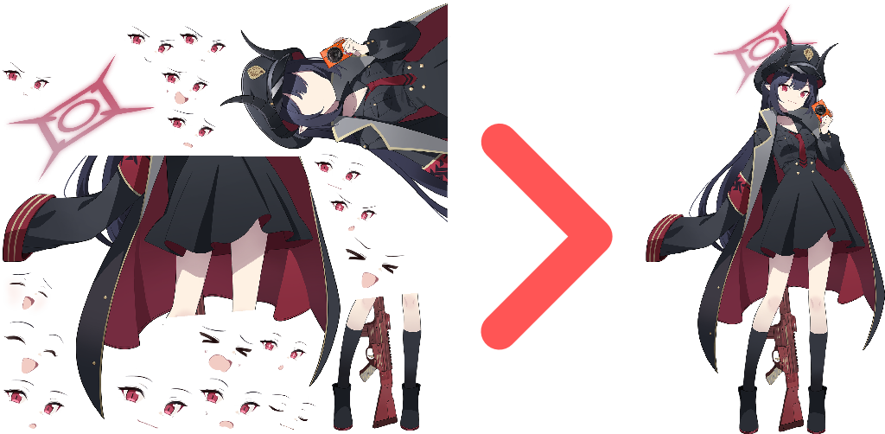

# Spine2Dump
Turn jumbled **Spine2D** rips into their correct sprites.

Supports Spine `3.5`, `3.6`, `3.7`, `3.8`, `4.0`, `4.1`, and `4.2`.

<div>
  
</div>


## Usage

```shell
# Input should always be a directory containing .skel, .atlas, and .png

# Inspect spine, list and validate the assets, print skeleton info, animations, and expression candidates
spine2dump inspect ./assets

# Dump spine animation frames as numbered PNGs
spine2dump dump ./assets -o ./output --animation idle --start 0 --end 2 --fps 30

# Export 2 seconds of the idle animation as video or GIF
spine2dump dump ./assets -o ./output --animation idle --start 0 --end 2 --fps 30 --format video

# Use a different video codec when needed
spine2dump dump ./assets -o ./output --animation idle --format video --codec ffv1

# Render one still per expression attachment instead of animation frames
spine2dump dump ./assets -o ./output --stills

# Crop all frames of an animation to one shared box with 8px padding
spine2dump dump ./assets -o ./output --animation idle --trim-mode animation --trim-padding 8

# Render onto a 1024x1024 canvas with an extra 1.5x scale
spine2dump dump ./assets -o ./output --size 1024 --scale 1.5

# Render onto a non-square canvas and crop transparent borders
spine2dump dump ./assets -o ./output --width 1280 --height 720 --trim
```

## Expressions

Spine does not have one universal "expression" asset type. Depending on the rig, expressions may be separate animations, skins, slots, or attachment variants. The included sample stores expressions as attachments on the `00_Default` slot (`01_nomal`, `02_respond`, `03_smile`, ...).

```shell
# List the detected expression candidates (part of `inspect`)
spine2dump inspect ./assets

# Render one still per detected expression candidate
spine2dump dump ./assets -o ./output --stills
```

<details>
  <summary>Command Line</summary>

### `spine2dump --help`

| Command             | Description                                                      |
|---------------------|-----------------------------------------------------------------|
| `inspect`           | Scan + validate atlas pages, print skeleton info, animations, and expression candidates |
| `dump`              | Dump animation frames, or one still per expression (`--stills`) |
| `--help`            | Print help                                                      |

---

### `spine2dump dump <asset-dir> --help`

| Option                        | Description                                   | Default             |
|-------------------------------|-----------------------------------------------|---------------------|
| `-o`, `--output <output-dir>` | Output directory for the dumped images        |                     |
| `--stills`                    | Render one still per expression attachment instead of animation frames | |
| `--animation <name>`          | Animation name to dump                        |                     |
| `--start <seconds>`           | Start time in seconds                         | `0`                 |
| `--end <seconds>`             | End time in seconds                           |                     |
| `--fps <value>`               | Frames per second                             | `30`                |
| `--size <px>`                 | Square output canvas size                     |                     |
| `--width <px>`                | Output canvas width                           |                     |
| `--height <px>`               | Output canvas height                          |                     |
| `--scale <value>`             | Render scale multiplier applied after fit     | `1.0`               |
| `--trim`                      | Crop transparent borders per image            |                     |
| `--trim-mode <mode>`          | Animation crop behavior                       | `none`, `frame`, `animation` |
| `--trim-padding <px>`         | Padding kept around trimmed bounds            | `0`                 |
| `--alpha-threshold <0-255>`   | Minimum alpha counted as visible              |                     |
| `--compression <preset>`      | PNG compression preset (all lossless)         | `fast`, `balanced`, `small` |
| `--format <format>`           | Animation output format                       | `image`, `gif`, `video` |
| `--codec <codec>`             | Video codec                                   | `h264`, `mpeg4`, `ffv1` |
| `--help`                      | Print help                                    |                     |

The animation/time options (`--animation`, `--start`, `--end`, `--fps`, `--trim-mode`) are ignored in `--stills` mode. Media formats are only supported for animation dumps. `--codec` only applies to `--format video`.

</details>

## Building

1. Install [CMake](https://cmake.org), [Ninja](https://ninja-build.org), and [Clang](https://clang.llvm.org)
2. Clone this repository
```sh
git clone https://github.com/Deathemonic/Spine2Dump
cd Spine2Dump
```
3. Build using `cmake`
```sh
cmake -S . -B build -G Ninja -DCMAKE_C_COMPILER=clang
cmake --build build
```

The executable is generated at `build/spine2dump`.

To change the embedded runtime list, pass `SPINE_VERSIONS`:
```sh
cmake -S . -B build -G Ninja -DCMAKE_C_COMPILER=clang -DSPINE_VERSIONS="3.8;4.2"
```

### Contributing
Don't like my [shitty code](https://www.reddit.com/r/programminghorror) and what to change it? Feel free to contribute by submitting a **pull request** or **issue**. Always appreciate the help.

### Acknowledgement
- [EsotericSoftware/spine-runtimes](https://github.com/EsotericSoftware/spine-runtimes)
